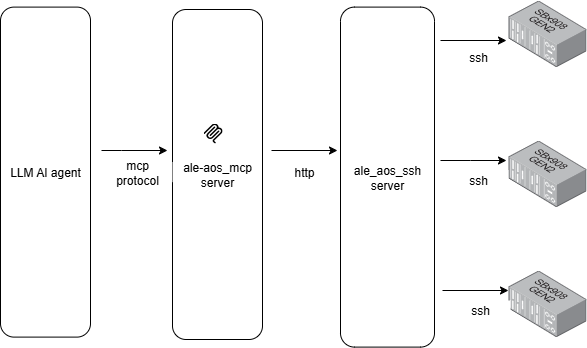
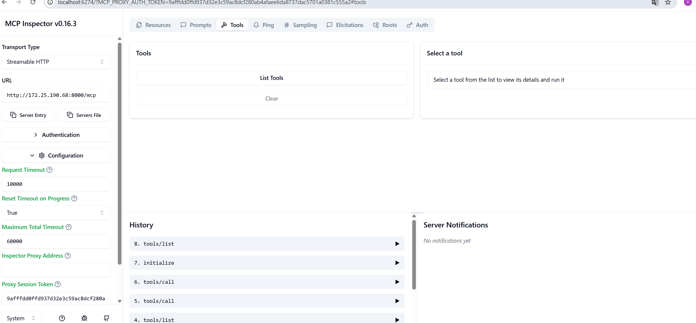
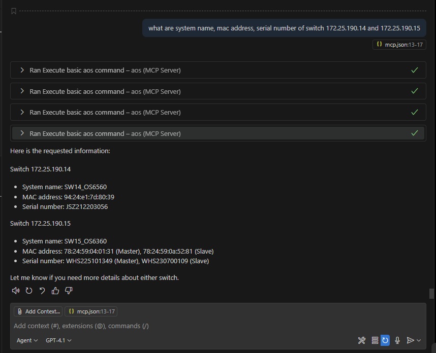
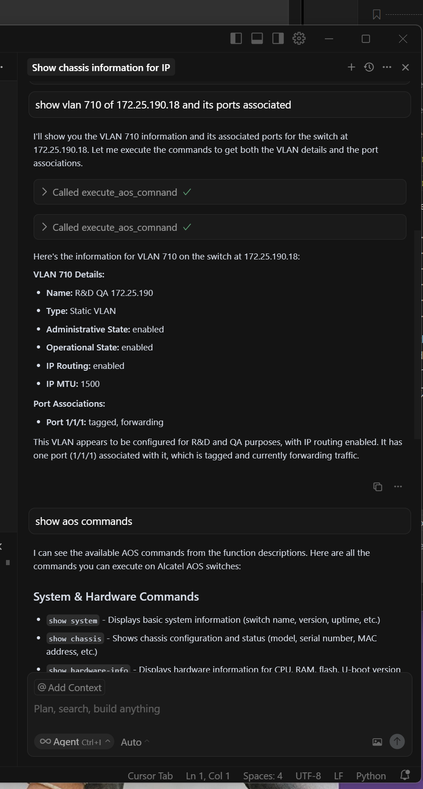
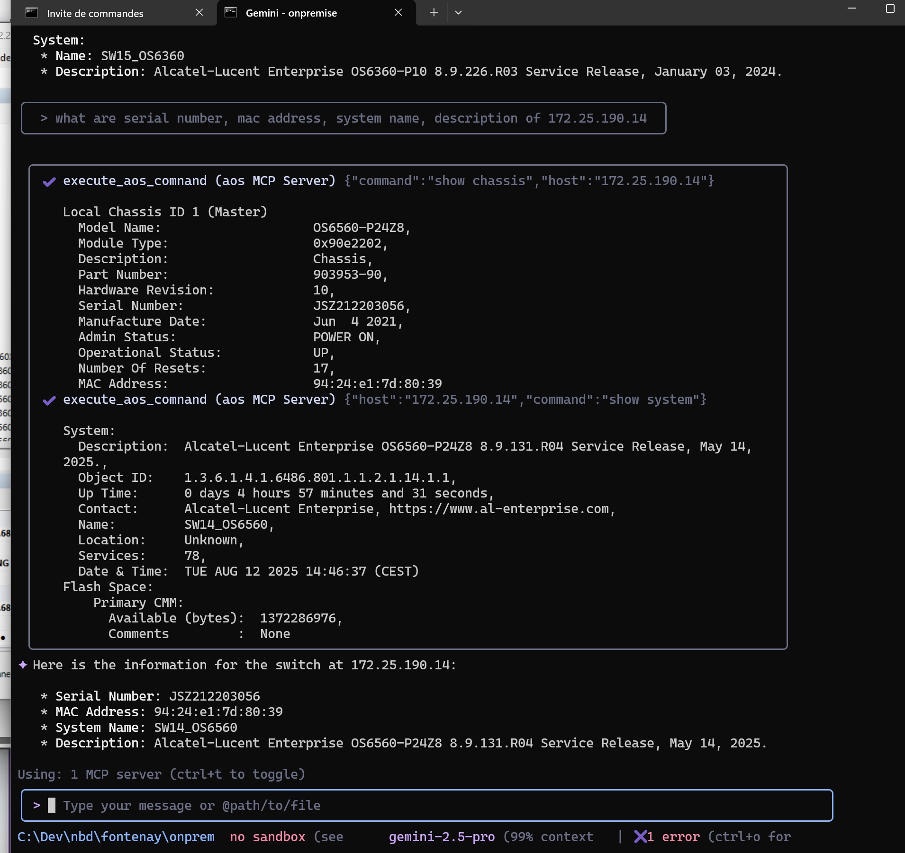
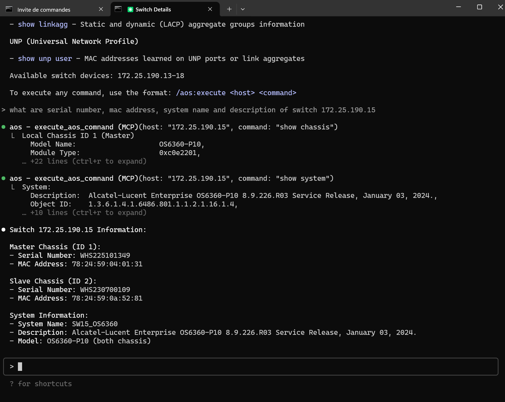

# ALE AOS mcp server 

This project provides a mcp (model context protocol) server for alcatel aos switches, see https://modelcontextprotocol.io/docs/getting-started/intro. 
Basic switch cli commands can vbe used through a ssh connection.
It enables LLM interactions with alcatel aos network switches.
It contains two subprojects :
 - aos_ssh : provides a rest API to run ssh cli command on ALE aos switches
 - aos_mcp : mcp server providing mcp tools to llm to run basic ssh commands through aos_ssh server REST api.  

## Demo with github copilot cli

<video src="pictures/copilot-aos-mcp.mp4" width="320" height="240" controls></video>

## Architecture




## Deploy mcp and ssh servers 

Docker images for aos_ssh and aos_mcp servers are availables:
  - docker.io/foricher/ale-aos-ssh:[tag]
  - docker.io/foricher/ale-aos-mcp:[tag]

Under  `deploy` folder, the mcp server side is available with a docker compose deployment.

### ale-aos-ssh configuration

Update `data\aos-ssh-host.json` file with your switches host, user, password for ssh connections. 

```json
{
  "jump_ssh_hosts": [
    {
      "name": "jump_name",
      "public_host": "public_host_or_ip_address",
      "public_port": 22,
      "private_host": "private_host_or_ip_address",
      "private_port": 22,
      "user": "jump_user",
      "password": "jupmp_password"
    }
  ],
  "hosts": [
    {
      "host": "host_or_ip_address1",
      "user": "user",
      "password": "password",
      "tags": ["sw1"]
    },
    {
      "host": "host_or_ip_address2",
      "user": "user",
      "password": "password",
      "tags": ["sw2"],
      "jump_ssh_name": "jump_name"
    }
  ]
}
```

Update `data\aos-ssh-conf.yaml` file with allowed aos commands. 

```yaml
allowed_aos_commands:
  - show .*
  - ping .*
  - traceroute .*

```

### ale-aos-ssh configuration

`data\mcp_tools.yaml` file describes tools used by LLM to run aos commands. 


### docker compose file

`docker-compose.yaml` file:
```yaml
services:
  aos-ssh:
    image: docker.io/foricher/ale-aos-ssh:0.1.2.1
    ports:
      - "8210:8110"
    volumes:
      - ./data/aos-ssh-host.json:/app/data/aos-ssh-host.json
      - ./data/aos-ssh-conf.yaml:/app/data/aos-ssh-conf.yaml
  aos-mcp:
    image: docker.io/foricher/ale-aos-mcp:0.1.2
    ports:
      - "8000:8000"
    environment:
      - ALE_AOS_MCP_SSH_URL=http://aos-ssh:8110
      - ALE_AOS_MCP_TRANSPORT=streamable-http
#      - ALE_AOS_MCP_TRANSPORT=sse
      - ALE_AOS_MCP_TOOLS_FILE=/app/data/mcp_tools.yaml
    volumes:
      - ./data:/app/data
    depends_on:
      - aos-ssh
```

Launch docker compose

```bash  
 cd deploy
 docker compose up 
``` 

By default, mcp server is deployed with transport streamable-http

## Test with mcp inspector

You can test aos mcp server by using mcp inpector tool, see https://modelcontextprotocol.io/legacy/tools/inspector 

```  
npx @modelcontextprotocol/inspector
```  

- Use Tranport Type : Streamable HTTP
- Enter your url : http://mcp-host:8000/mcp
- Enter proxy session Token





 ## Client


- Connect to remote MCP server with Streamable http transport.

  Both servers ale_aos_mcp, ale_aos_ssh run remotely.

 ```json
 {
  "mcpServers": {
    "aos": {
      "type": "http",
      "url": "http://<aos-mcp-host>:8000/mcp"
    }
  }
}

 ```

- Connect to local MCP server with stdio transport.

  Local ale_aos_mcp server connect to a remote ale_aos_ssh server via provided argument --aos-ssh-url url.


 ```json
{
    "mcpServers": {
        "aos": {
            "command": "uv run ale_aos_mcp",
            "args": [
                "--aos-ssh-url",
                "http://<aos-ssh-host>:8210"
            ],
            "env": {
            }
        }
    }
}
 ```

 ### Use Github Copilot with visual stdio code

Under your workspace, inside `.vscode` folder, put file `mcp.json` as below. 
- with Streamable http transport

 ```json
 {
  "servers": {
    "aos": {
      "type": "http",
      "url": "http://<aos-mcp-host>:8000/mcp"
    }
  }
}

 ```

- with stdio transport

 ```json
{
    "servers": {
        "aos": {
            "command": "uv run ale_aos_mcp",
            "args": [
                "--aos-ssh-url",
                "http://<aos-ssh-host>:8210"
            ],
            "env": {
            }
        }
    }
}
 ```

Set chat `agent` mode





 ### Use cursor with visual stdio code

Under your workspace, inside `.cursor` folder, put file `mcp.json` as below.

Set chat `agent` mode

 ```json
{
    "mcpServers": {
        "aos": {
            "url": "http://<aos-mcp-host>:8000/mcp"
        }
    }
}
 ```




### Use gemini cli

 put under `.gemini` folder, file 'settings.json' as below. 

  ```json
{
  "mcpServers": {
    "aos": {
      "name": "AOS MCP Server",
      "description": "AOS MCP Server for managing AOS switches",
      "httpUrl": "http://<aos-mcp-host>:8000/mcp",
      "timeout" : 60000
    }
  }
}
```

Zscaler issue 
```bash 
set NODE_EXTRA_CA_CERTS=C:\\Data\\zscaler\\zscaler.pem
set NODE_TLS_REJECT_UNAUTHORIZED=0
``` 

set gemini api key
```bash 
set GEMINI_KEY_API=<gemini-api-key>
``` 

install gemini-cli
```bash 
npm install -g @google/gemini-cli@latest
gemini -m gemini-2.5-flash
``` 
or 
```bash 
npx https://github.com/google-gemini/gemini-cli -m gemini-2.5-flash
``` 





### Use claude code cli

for more information see (https://docs.anthropic.com/en/docs/claude-code/mcp)

in case of Zscaler issue 
```bash 
set NODE_EXTRA_CA_CERTS=C:\\Data\\zscaler\\zscaler.pem
set NODE_TLS_REJECT_UNAUTHORIZED=0
``` 


install claude code
```bash 
npm install -g @anthropic-ai/claude-code
```

under your project 
```bash 
cd <project>
```

add aos mcp server to claude into project.
```bash 
claude mcp add --transport http --scope project aos http://<mcp-server-host>:8000/mcp
```

run claude.
```bash 
claude
```



